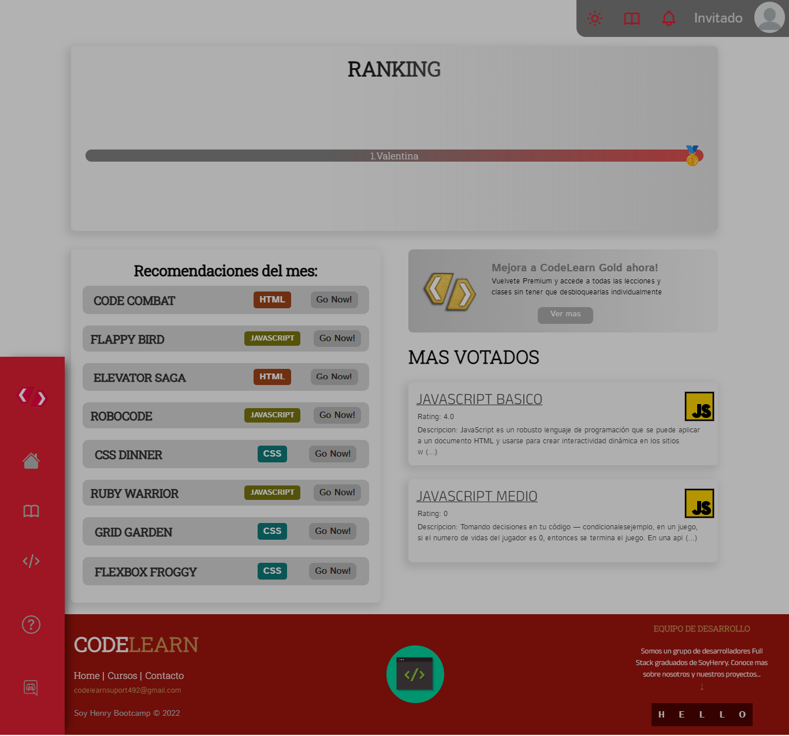
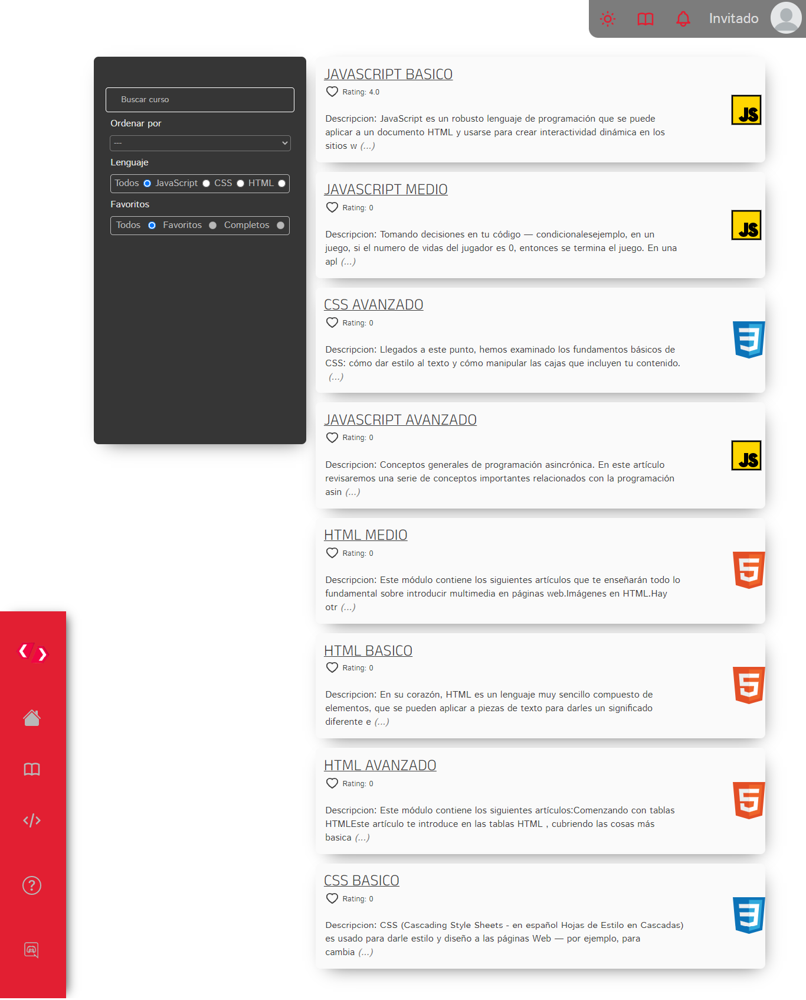
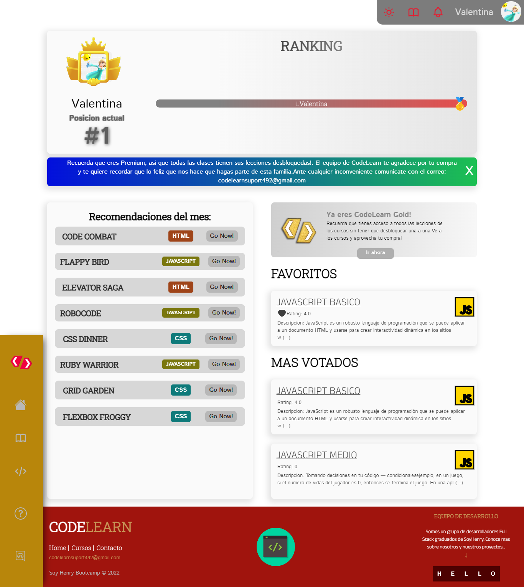
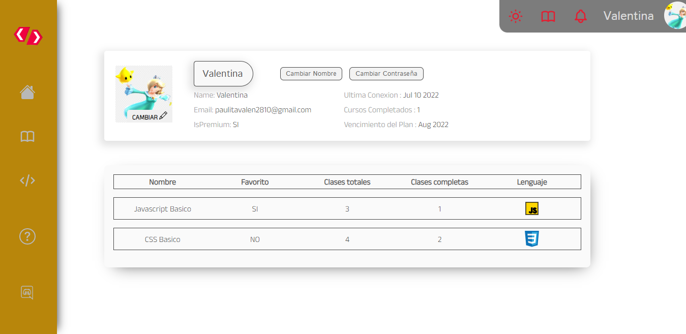
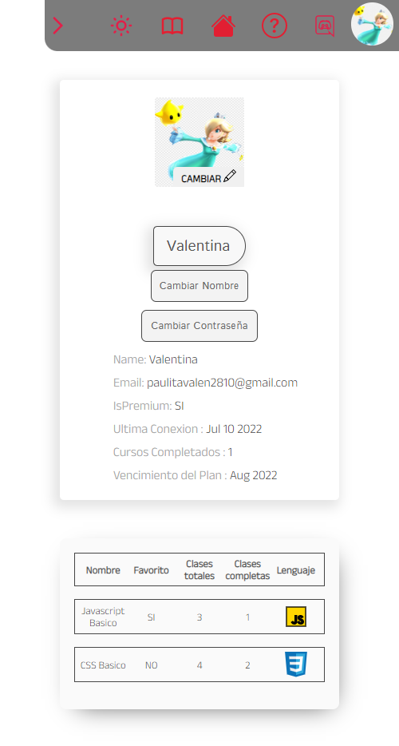
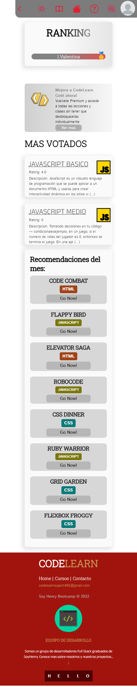
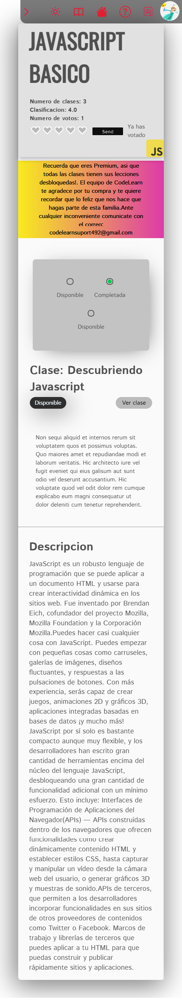

<h1 align="center">👩🏻‍💻 Welcome to CodeLearn 🖥️</h1>
<h2 align="center">A app built for our final group project at Soy Henry's Bootcamp </h2>

## Planteamiento/ Approach:
Es:Nuestro objetivo principal es fomentar la cultura del mundo TI e interesar tanto a
niños como adolescente en el desarrollo web. Buscamos crear un entorno educativo digital
donde nuestros usuarios puedan familiarizarse con la lógica de programación y en el cual
los mismos aprendan los fundamentos básicos sobre la creación de sitios web.

Nuestro proyecto busca motivar a sus usuarios mediante el uso de herramientas
interactivas y didácticas que vuelvan el flujo de aprendizaje más entretenido, y a través de
la implementación de un ecosistema de competencia sana (Sistema de Rankings) que
logren que nuestros clientes si automotiven a superar/completar cursos con el fin de tener
un puesto más elevado en la competición.

También cabe destacar que cada usuario tendrá un perfil en el que se mostrará un
nivel de aprendizaje, este nivel iría aumentando entorna a que el estudiante vaya
completando clases, esto permitiría que el usuario este al tanto de su progreso general
todo el tiempo.

-------------------------------------

En:Our objective is to promote the culture of the IT world and interest both
children as a teenager in web development. We seek to create a digital educational environment
where our users can become familiar with the programming logic and in which
they learn the basics of website creation.

Our project seeks to motivate its users through the use of tools
interactive and didactic that make the flow of learning more entertaining, and through
the implementation of an ecosystem of healthy competition (Ranking System) that
achieve that our clients self-driven to pass/complete courses in order to have
a higher position in the competition.

It should also be noted that each user will have a profile in which a
level of learning, this level would increase around the time the student goes
completing classes, this would allow the user to be aware of their general progress

## Aclaracion/ Clarification:
Es:Este repositorio es una version personal del proyecto original. El panel lateral se visualiza abajo por ser un screenshot largo.

-------------------------------------

En:This repository is a personal version of the original project

  

 

   <table align="center" style="background-color:#FFFFFF; width:50%" >
   <h2 align="center">🚀Site Demo for this Repo:</h2> 
   <h3 align="center">📲Take a look in the following link: https://pf-indol.vercel.app/</h3>
   <h5 align="center">📲For the oginal proyect: https://proyecto-fbno4cuyu-kraosfex.vercel.app/</h5>
   <tr style="background-color:#FFFFFF;display:flex;flex-direction:column;align-items: center;">
    <th><h2>⚙Built with </h2></th>
    <th></th> 
    <th></th>
    <th></th>
    <th></th>
    <th></th>
    <th></th>
    <th></th>
    <th></th>
    <th></th>
   </tr>
   <h3 align="center">🧑‍💻Meet the team!</h3>
   
 
   
   
   
   
   
   </table>
  

## Galeria/Gallery:
-------------------------------------
<table style="width:100%">

</table>

## Responsive Dessing:
